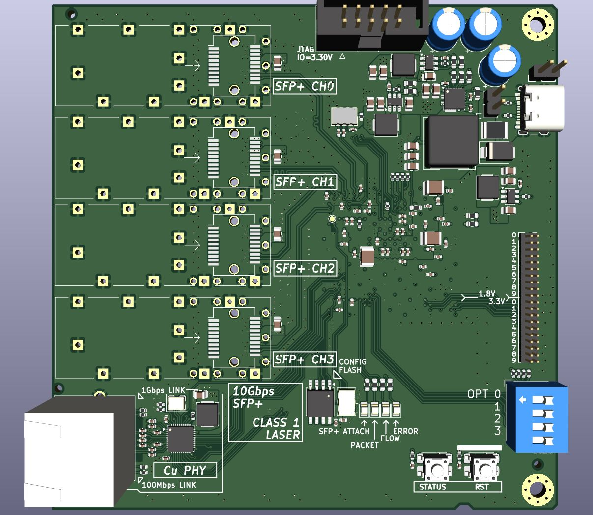
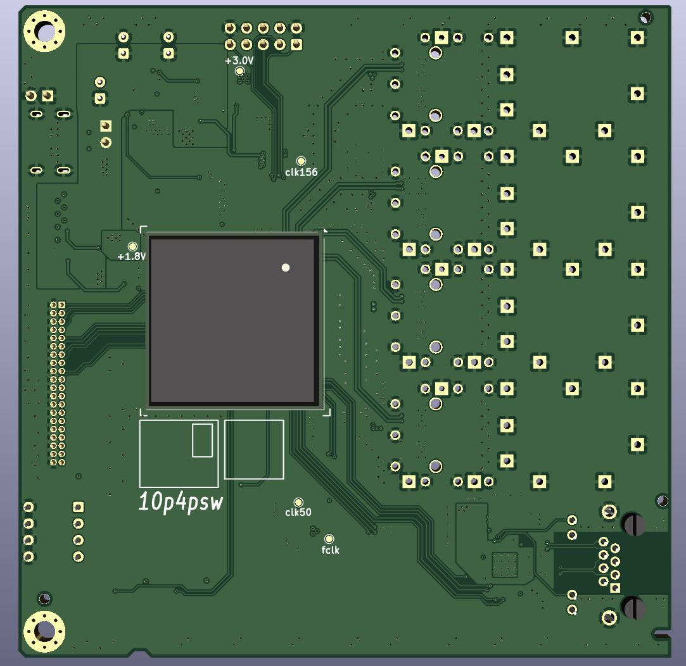

## 10g4psw - 10Gbps 4 Port SFP+ Switch with Kintex-7 FPGA

---

# (In Progress!)

This repo holds the hardware files for my 10Gbps 4 port Ethernet Switch project, details can be found on the Github Home Page.

### Core Specs

- Process: 4-Layer JLC PCB Standard Stackup, no in-pad Via required
- Core: Kintex-7 (xc7k325t-ffg676), 1 SerDes QUAD used.
- IO: 4x port SFP+, 1x RJ-45 with 1Gbps Copper Port.
- 1Gbps Copper PHY: RTL8211F with RGMII Interface.

### Power Conversion Circuit

- Input: 5V USB-C nom. 3A, accepts 4.5V - 20V.
- VCCINT 1.0V: SiC431, max. current 24A, designed for max. 10A
- 1.2V (SerDes), 1.8V (Analog), 3.3V (IO): Generic SOT-23-6 Buck, 3A max.

### To be Implemented Tasks

- I2C Interface on SFP+ modules are not routed.
- 1Gbps Copper Ethernet is not Isolated.
- Tighter Impedance control of SerDes lines is possible through alternative process / optimizing routing.