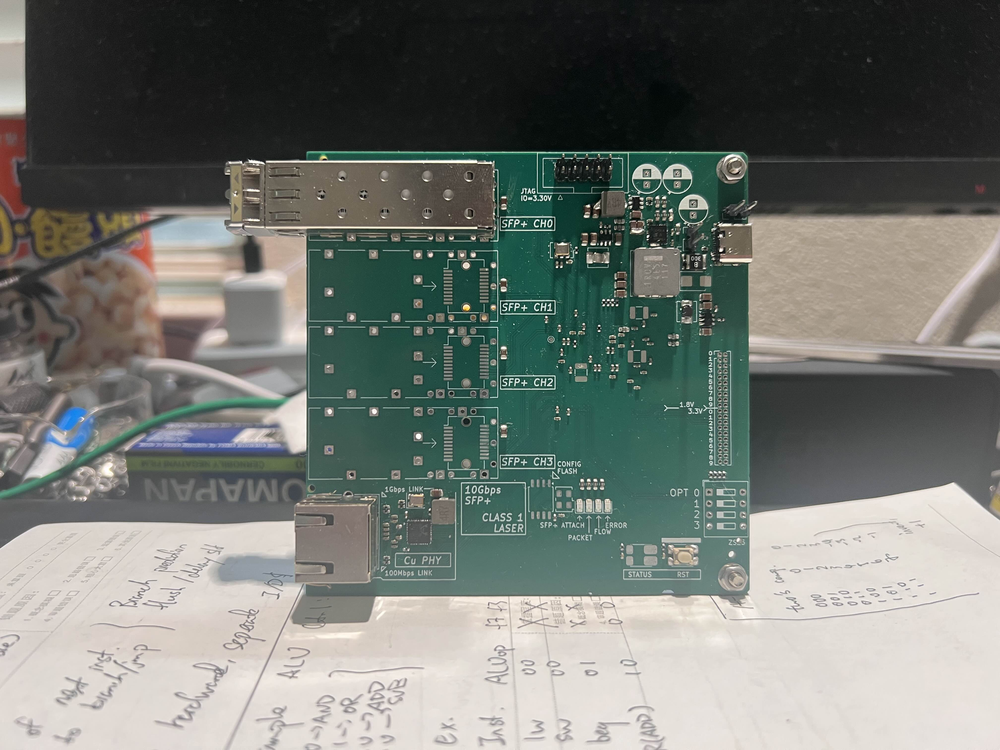

## 10g4psw - 10Gbps 4 Port SFP+ Switch with Kintex-7 FPGA

---

# (In Progress!)

This repo holds the hardware files for my 10Gbps 4 port Ethernet Switch project, details can be found on the Github Home Page.

### Core Specs

- Process: 4-Layer JLC PCB Standard Stackup, no in-pad Via required.
- Core: Kintex-7 (xc7k325t-ffg676), 1 SerDes QUAD used.
- IO: 4x port SFP+, 1x RJ-45 with 1Gbps Copper Port.
- 1Gbps Copper PHY: RTL8211F with RGMII Interface. (See Errors)

### Power Conversion Circuit

- Input: 5V USB-C nom. 3A, accepts 4.5V - 20V.
- VCCINT 1.0V: SiC431, max. current 24A, designed for max. 10A (Tested, OK)
- 1.2V (SerDes), 1.8V (Analog), 3.3V (IO): Generic SOT-23-6 Buck, 3A max. (Tested, OK)

### To be Implemented Tasks

- I2C Interface on SFP+ modules are not routed.
- 1Gbps Copper Ethernet is not Isolated.
- Tighter Impedance control of SerDes lines is possible through alternative process / optimizing routing.

### Known Errors

1. 50MHz Oscillator routed to wrong pin. the N pin of a MRCC port is a valid clock input, instead it must be routed to the P.

2. Wrong pin-pair order for RJ-45 Copper port. The whole connector is reversed - pin8 goes to pair 1+ etc. This might be fix-able by tuning the MDIX register inside the PHY. 

3. Improvement: Component spacing on power section is too close, possible of solder bridges if not careful. 

### Link Quality Test

**Setup:** Using on-board 156.25MHz LVDS Oscillator, IBERT program loaded with 10g ethernet config. The SFP+ optical module (850nm duplex, 10G capable) is plugged into the SFP+ housing in port 0. A 1m long OM4 grade fiber is connected from the output port to the input port on the SFP+ optical module. 

The internal loopback mode in GTX is disabled. Tx pre-post cursor is set to 0dB, voltage swing is set to maximum (~1V). Test Pattern is PRBS-31.

Target BER is 10^-9, the scan took around 20 minutes to complete. Without heatsink, the Kintex-7 FPGA was around 60 degC. SFP+ module remained at room temperature. 

